# Architecture & Data Model

> **Purpose:** Explain how the Ambac Quality Management System ("Pizza Tracker") works under the hood — its
> architecture, data model, and integration patterns. This serves as the technical backbone for the documentation
> portfolio.

---

## 1. TL;DR

* **Problem this solves:** Real-time manufacturing traceability and quality assurance for military-grade diesel injector
  production.
* **Core idea:** React + Django + LangGraph + Postgres + Redis + Ollama stack enabling a self-contained, AI-augmented
  QMS with audit trails and compliance.
* **Primary users / actors:** QA Inspectors, Operators, Managers, Customers, AI Assistant (LangGraph).
* **Non-goals:** External LLMs, mobile app — deferred until compliance and security maturity achieved.
* **Multi-tenancy:** In progress — see [MULTI_TENANCY_ROADMAP.md](./MULTI_TENANCY_ROADMAP.md) and [PERMISSION_SYSTEM_REFACTOR.md](./PERMISSION_SYSTEM_REFACTOR.md).

---

## 2. System Architecture (How It Works)

### 2.1 High-Level Diagram

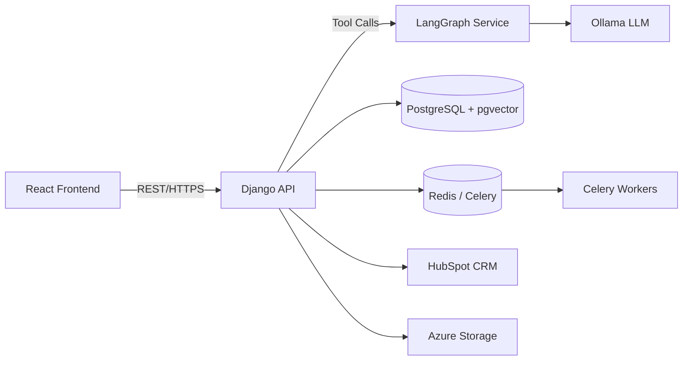

### 2.2 Component Overview

| Component                 | Responsibility                         | Key Interactions                    | Why I Chose X                                                                                                                    |
|---------------------------|----------------------------------------|-------------------------------------|----------------------------------------------------------------------------------------------------------------------------------|
| **React Frontend (Vite)** | Operator & customer UI                 | Django REST API                     | Faster iteration speed, larger community resources, makes three js Much easier                                                   |
| **Django API**            | Core logic, audit, RBAC                | Postgres, LangGraph, Redis, HubSpot | Mature framework with security hardening and a significant amount of features either straight out of the box or with OSS modules |
| **LangGraph**             | Orchestrates LLM tools via ReAct agent | Django REST API, Ollama             | Deterministic graph-based reasoning, reproducible tool execution, built-in debugging and replay capabilities                     |
| **Ollama**                | Local LLM inference                    | LangGraph                           | Keeps data on-prem for ITAR compliance                                                                                           |
| **PostgreSQL + pgvector** | Canonical DB + semantic search         | Django ORM                          | Combines relational integrity with vector search                                                                                 |
| **Redis + Celery**        | Async jobs, notifications              | Django, Workers                     | Scalable, reliable task queue                                                                                                    |
| **HubSpot**               | CRM integration                        | Django                              | Single source of truth for customers                                                                                             |
| **Azure App Services**    | Hosting and isolation                  | Django, Redis, LangGraph            | Secure managed environment                                                                                                       |

---

## 3. Data Flow Example

### Query: *“Which parts are quarantined?”*

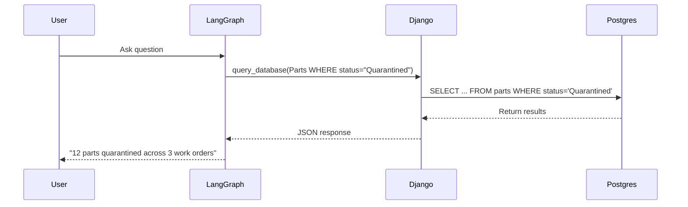

> **Why I Chose X:** LangGraph routes natural language to structured ORM queries for auditable AI behavior.

---

## 4. Data Model (ERD)

The data model is organized into several functional domains for clarity.

### 4.1 Core Manufacturing Flow

This diagram shows the main production workflow from customer orders to parts.

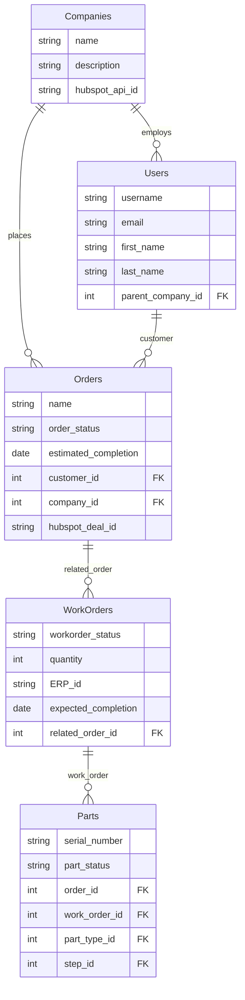

### 4.2 Process Configuration & Workflow

Defines part types, manufacturing processes, and sequential steps.

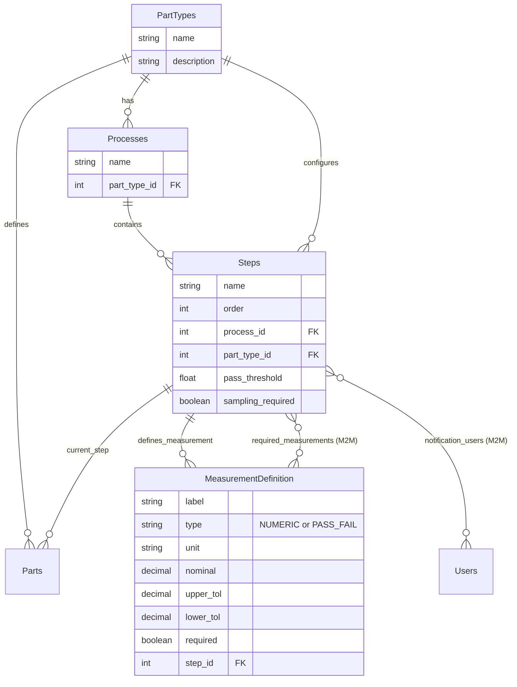

### 4.3 Quality Management System

Inspection, measurements, and non-conformance tracking.

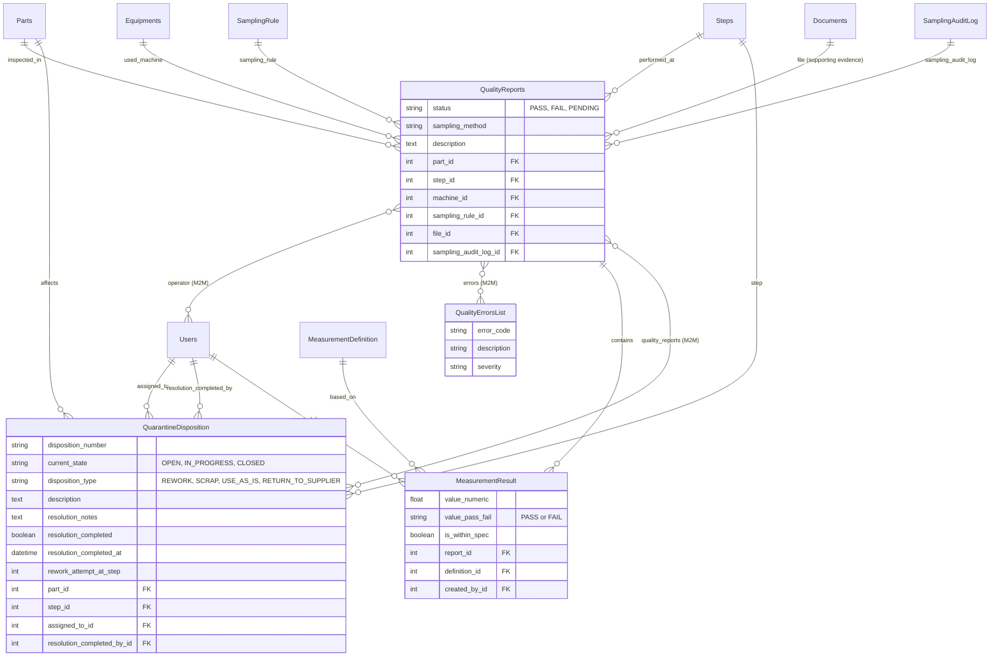

### 4.3.1 Step Workflow Control

First Piece Inspection, overrides, rollbacks, and measurement tracking at the step execution level.

```mermaid
erDiagram
    WorkOrders ||--o{ FPIRecord: "fpi_for"
    Steps ||--o{ FPIRecord: "step"
    Users ||--o{ FPIRecord: "designated_by"
    Users ||--o{ FPIRecord: "verified_by"
    Parts ||--o{ FPIRecord: "fpi_part"
    StepExecution ||--o{ StepOverride: "execution"
    Users ||--o{ StepOverride: "requested_by"
    Users ||--o{ StepOverride: "approved_by"
    StepExecution ||--o{ StepExecutionMeasurement: "execution"
    MeasurementDefinition ||--o{ StepExecutionMeasurement: "definition"
    Users ||--o{ StepExecutionMeasurement: "recorded_by"
    StepExecution ||--o{ StepRollback: "execution"
    Users ||--o{ StepRollback: "requested_by"
    Users ||--o{ StepRollback: "approved_by"

    FPIRecord {
        string status "PENDING, PASSED, FAILED, WAIVED"
        string fpi_scope "PER_WORK_ORDER, PER_SHIFT, PER_EQUIPMENT, PER_OPERATOR"
        datetime designated_at
        datetime verified_at
        text notes
        int work_order_id FK
        int step_id FK
        int fpi_part_id FK
        int designated_by_id FK
        int verified_by_id FK
    }

    StepOverride {
        string override_type "MISSING_QA, MEASUREMENT_FAIL, FPI_FAIL, TRAINING_EXPIRED, etc."
        string status "REQUESTED, APPROVED, REJECTED, EXPIRED"
        text reason
        text approval_notes
        datetime requested_at
        datetime approved_at
        datetime expires_at
        int execution_id FK
        int requested_by_id FK
        int approved_by_id FK
    }

    StepExecutionMeasurement {
        decimal value
        string value_string
        boolean is_within_spec
        datetime recorded_at
        int execution_id FK
        int definition_id FK
        int recorded_by_id FK
    }

    StepRollback {
        string status "REQUESTED, APPROVED, REJECTED, COMPLETED"
        text reason
        text approval_notes
        datetime requested_at
        datetime approved_at
        datetime completed_at
        int execution_id FK
        int requested_by_id FK
        int approved_by_id FK
    }
```

> **FPI (First Piece Inspection):** Validates setup at production start. FPIRecord tracks which part is designated for FPI, its verification status, and scope (per work order, shift, equipment, or operator).
>
> **StepOverride:** Escape hatch for blocked parts. When a part cannot advance due to missing QA, failed measurements, etc., an override can be requested and approved by supervisors.
>
> **StepExecutionMeasurement:** Tracks measurements at the execution level (not tied to QualityReports/sampling). Enables 100% measurement capture.
>
> **StepRollback:** Controlled mechanism to move parts backward through the process with approval workflow.

### 4.4 Equipment & Resources

Equipment types, instances, and usage tracking.

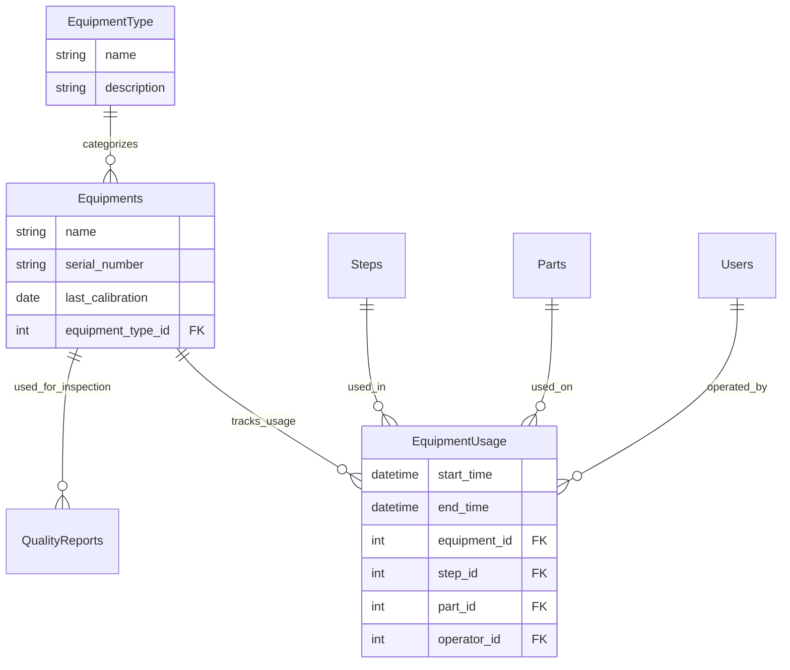

### 4.5 Sampling & Statistical Process Control

Inspection sampling rules, audit logs, and SPC baseline management.

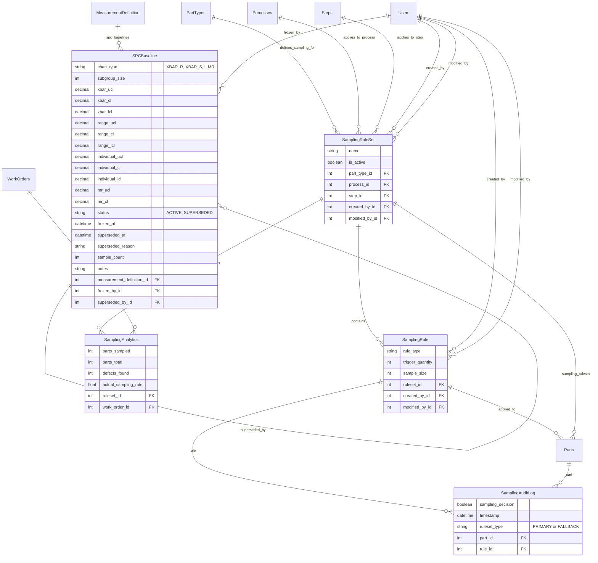

### 4.6 Document Management & AI Search

Document storage with semantic search capabilities. Documents use Django's GenericForeignKey to attach to any entity.

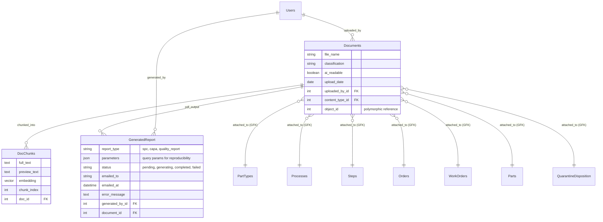

> **Note:** Documents use Django's ContentType framework (Generic Foreign Keys) to attach to multiple entity types
> without creating separate foreign key fields for each.
>
> **GeneratedReport** tracks PDF generation requests and links to the DMS via the `document` foreign key. This enables
> audit trails for all generated reports while storing the actual PDF files in the unified document management system.

### 4.7 Visualization & Collaboration

3D models and defect annotations.

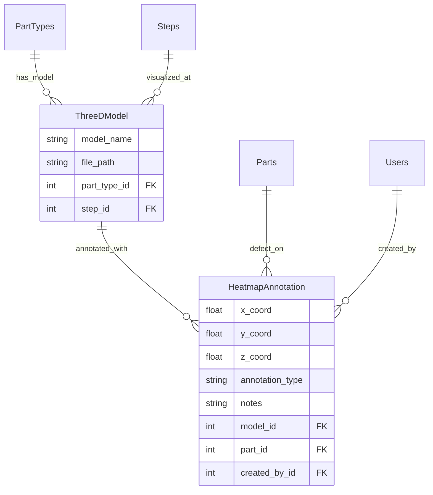

### 4.8 Tracking & Notifications

Progress tracking and notification system.

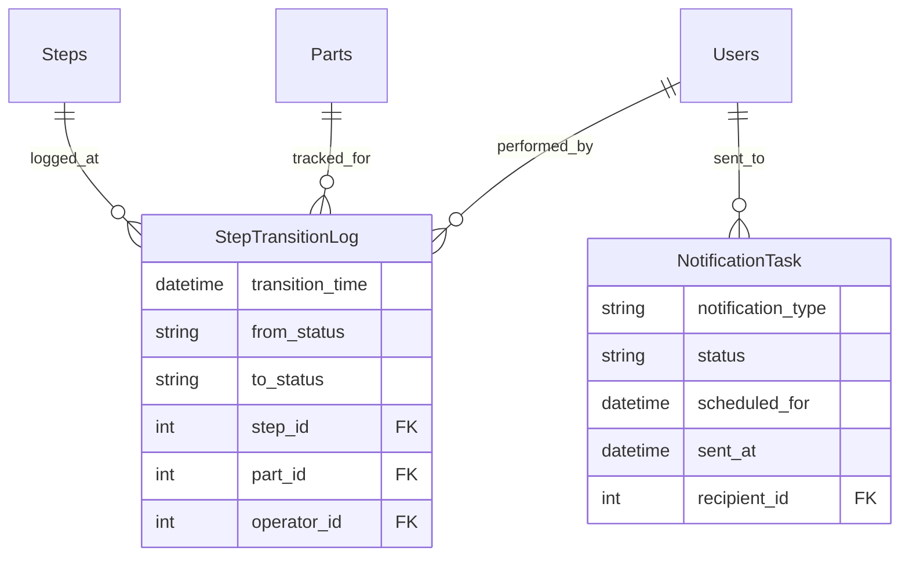

### 4.9 External Integrations

HubSpot CRM synchronization.

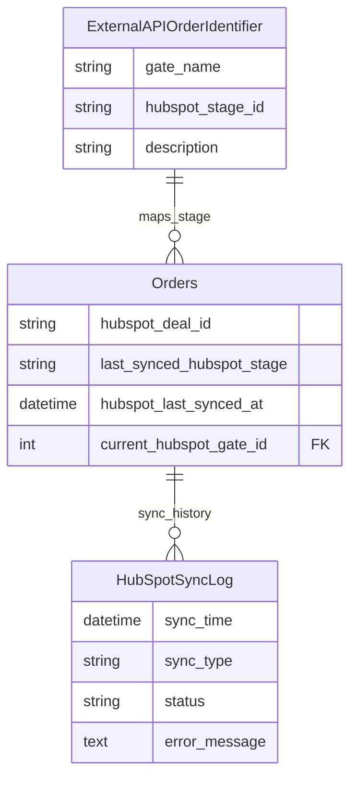

### 4.10 CAPA (Corrective and Preventive Action)

Full corrective action workflow with root cause analysis and effectiveness verification.

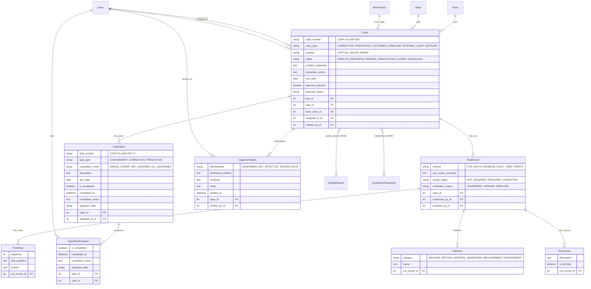

> **CAPA Status Flow:**
> ```
> OPEN → IN_PROGRESS → PENDING_VERIFICATION → CLOSED
>          ↓                    ↓
>       CANCELLED           CANCELLED
> ```
> - `transition_to()` method validates state transitions with blocker checks
> - Auto-approval triggered for Critical/Major severity CAPAs
> - Rejection resets `approval_required` for re-request

### 4.11 Approval Workflow

Universal approval system using Django ContentTypes for any model (Documents, CAPAs, etc.).

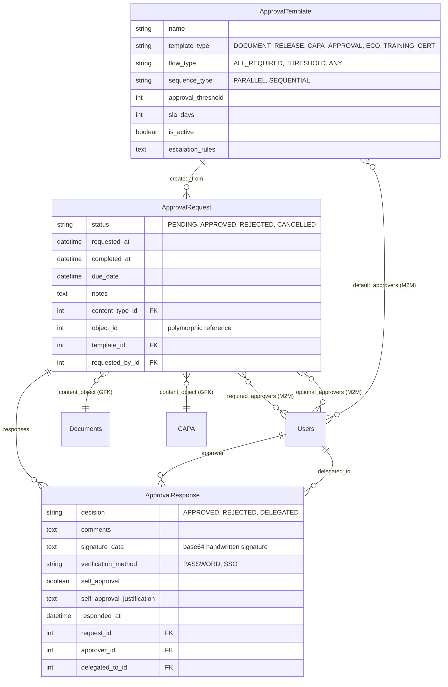

> **Key Features:**
> - **Sequential approval**: Approvers must respond in order (first approves → second notified)
> - **Signature capture**: Handwritten signature with identity verification (password re-entry)
> - **Self-approval validation**: Configurable bypass with justification tracking
> - **Delegation**: Approvers can delegate to another user
> - **Auto-triggering**: Critical/Major CAPAs auto-create approval requests via signals

### Entity Summary

#### Core Manufacturing Entities

| Entity         | Description                   | Key Relationships                            | Notes                                                     |
|----------------|-------------------------------|----------------------------------------------|-----------------------------------------------------------|
| **Companies**  | Customer organizations        | Users, Orders                                | Parent entity for customer isolation                      |
| **Users**      | System actors                 | Companies, all entities                      | RBAC groups: Admin, QA_Manager, QA_Inspector, Production_Manager, Production_Operator, Document_Controller, Customer |
| **Orders**     | Customer orders               | Companies, Users, WorkOrders                 | HubSpot sync, APQP phase tracking                         |
| **WorkOrders** | Production batches/jobs       | Orders, Parts, SamplingAuditLog              | ERP integration, timing tracking                          |
| **Parts**      | Individual manufactured items | WorkOrders, PartTypes, Steps, QualityReports | Serial number tracking, step-by-step lifecycle            |

#### Configuration & Process Design

| Entity                    | Description                       | Key Relationships           | Notes                            |
|---------------------------|-----------------------------------|-----------------------------|----------------------------------|
| **PartTypes**             | Types of parts manufactured       | Processes, Steps, Parts     | Defines what can be built        |
| **Processes**             | Manufacturing process definitions | PartTypes, Steps            | Workflow templates               |
| **Steps**                 | Individual process steps          | Processes, PartTypes, Parts | Inspection points, notifications |
| **MeasurementDefinition** | Required measurements per step    | Steps, Measurement          | Tolerances and specifications    |

#### Quality Management

| Entity                    | Description               | Key Relationships                                               | Notes                                                     |
|---------------------------|---------------------------|-----------------------------------------------------------------|-----------------------------------------------------------|
| **QualityReports**        | Inspection results        | Parts, Steps, Equipments, Users, SamplingRule, SamplingAuditLog | Pass/fail status, links to sampling decision              |
| **MeasurementResult**     | Specific measurement data | QualityReports, MeasurementDefinition, Users                    | Actual vs. target values, auto-calculates spec compliance |
| **QualityErrorsList**     | Catalog of defect types   | QualityReports (M2M)                                            | Predefined error categories                               |
| **QuarantineDisposition** | NCR/rework records        | Parts, Steps, QualityReports (M2M), Users                       | Rework, scrap, use-as-is decisions with workflow tracking |

#### CAPA (Corrective & Preventive Action)

| Entity               | Description                    | Key Relationships                                             | Notes                                                        |
|----------------------|--------------------------------|---------------------------------------------------------------|--------------------------------------------------------------|
| **CAPA**             | Corrective/preventive actions  | QualityReports, QuarantineDisposition, Parts, Steps, Users    | Auto-numbering (CAPA-CA-2025-001), computed status, approval |
| **CapaTasks**        | Action items within CAPA       | CAPA, CapaTaskAssignee, Users                                 | Types: CONTAINMENT, CORRECTIVE, PREVENTIVE                   |
| **CapaTaskAssignee** | Multi-assignee task support    | CapaTasks, Users                                              | Completion modes: SINGLE_OWNER, ANY_ASSIGNEE, ALL_ASSIGNEES  |
| **RcaRecord**        | Root cause analysis record     | CAPA, FiveWhys, Fishbone, RootCause, Users                    | Methods: 5 Whys, Fishbone, Fault Tree, Pareto                |
| **FiveWhys**         | 5 Whys analysis entries        | RcaRecord                                                     | Sequential why questions and answers                         |
| **Fishbone**         | Fishbone diagram causes        | RcaRecord                                                     | 6M categories: Machine, Method, Material, etc.               |
| **RootCause**        | Identified root causes         | RcaRecord                                                     | Supports primary/secondary cause identification              |
| **CapaVerification** | Effectiveness verification     | CAPA, Users                                                   | Results: CONFIRMED, NOT_EFFECTIVE, INCONCLUSIVE              |

#### Approval Workflow

| Entity               | Description                  | Key Relationships                            | Notes                                                        |
|----------------------|------------------------------|----------------------------------------------|--------------------------------------------------------------|
| **ApprovalTemplate** | Reusable approval configs    | Users (default_approvers), ApprovalRequest   | Types: DOCUMENT_RELEASE, CAPA_APPROVAL, ECO, TRAINING_CERT   |
| **ApprovalRequest**  | Approval instance            | ApprovalTemplate, ApprovalResponse, Users    | Uses ContentType for Documents, CAPAs, etc.                  |
| **ApprovalResponse** | Individual approval decision | ApprovalRequest, Users                       | Decisions: APPROVED, REJECTED, DELEGATED; signature capture  |

#### Step Workflow Control

| Entity                       | Description                       | Key Relationships                                    | Notes                                                              |
|------------------------------|-----------------------------------|------------------------------------------------------|--------------------------------------------------------------------|
| **FPIRecord**                | First Piece Inspection tracking   | WorkOrders, Steps, Parts, Users                      | Scopes: PER_WORK_ORDER, PER_SHIFT, PER_EQUIPMENT, PER_OPERATOR     |
| **StepOverride**             | Override for blocked steps        | StepExecution, Users                                 | Types: MISSING_QA, MEASUREMENT_FAIL, FPI_FAIL, TRAINING_EXPIRED    |
| **StepExecutionMeasurement** | Measurements at execution level   | StepExecution, MeasurementDefinition, Users          | Enables 100% measurement capture (not tied to sampling)            |
| **StepRollback**             | Controlled backward movement      | StepExecution, Users                                 | Status workflow: REQUESTED → APPROVED/REJECTED → COMPLETED         |
| **StepRequirement**          | Configurable step gating rules    | Steps                                                | 10 types: measurement, document, signoff, training, FPI, etc.      |

#### Equipment & Resources

| Entity             | Description                 | Key Relationships                             | Notes                             |
|--------------------|-----------------------------|-----------------------------------------------|-----------------------------------|
| **EquipmentType**  | Categories of equipment     | Equipments                                    | Defines equipment classifications |
| **Equipments**     | Physical machines and tools | EquipmentType, EquipmentUsage, QualityReports | Calibration tracking              |
| **EquipmentUsage** | Equipment usage logs        | Equipments, Steps, Parts, Users               | Defect traceability               |

#### Sampling & Compliance

| Entity                | Description                   | Key Relationships                                | Notes                                                              |
|-----------------------|-------------------------------|--------------------------------------------------|--------------------------------------------------------------------|
| **SamplingRuleSet**   | Sampling strategy definitions | PartTypes, Processes, Steps, SamplingRule, Users | Defines when to inspect, tracks creator/modifier                   |
| **SamplingRule**      | Individual sampling rules     | SamplingRuleSet, Parts, SamplingAuditLog, Users  | First article, periodic, statistical rules                         |
| **SamplingAuditLog**  | Per-part sampling decisions   | Parts, SamplingRule                              | Records whether each part triggered sampling (PRIMARY or FALLBACK) |
| **SamplingAnalytics** | Aggregate sampling metrics    | SamplingRuleSet, WorkOrders                      | Tracks sampling rates and defect rates per work order              |
| **SPCBaseline**       | Frozen SPC control limits     | MeasurementDefinition, Users                     | Persists control limits with full audit trail (who, when, why)     |

#### Document & Knowledge Management

| Entity              | Description                 | Key Relationships                             | Notes                                           |
|---------------------|-----------------------------| ----------------------------------------------|-------------------------------------------------|
| **Documents**       | Files and media             | Generic relations to Orders, WorkOrders, etc. | Classification levels, AI-readable flag         |
| **DocChunks**       | Text chunks with embeddings | Documents                                     | Enables semantic search via pgvector            |
| **GeneratedReport** | PDF generation audit trail  | Documents (stores PDF), Users (generator)     | Tracks report requests, status, email delivery  |

#### Visualization & Collaboration

| Entity                | Description             | Key Relationships                   | Notes                               |
|-----------------------|-------------------------|-------------------------------------|-------------------------------------|
| **ThreeDModel**       | 3D CAD model references | PartTypes, Steps, HeatmapAnnotation | Visual inspection aids              |
| **HeatmapAnnotation** | Defect location markers | ThreeDModel, Parts, Users           | Visual defect tracking on 3D models |

#### Tracking & Notifications

| Entity                | Description              | Key Relationships   | Notes                            |
|-----------------------|--------------------------|---------------------|----------------------------------|
| **StepTransitionLog** | Part movement history    | Steps, Parts, Users | Audit trail for part progression |
| **NotificationTask**  | Async notification queue | Users               | Email/alert delivery tracking    |

#### Integration

| Entity                         | Description             | Key Relationships | Notes                           |
|--------------------------------|-------------------------|-------------------|---------------------------------|
| **ExternalAPIOrderIdentifier** | HubSpot pipeline stages | Orders            | Maps order status to CRM stages |
| **HubSpotSyncLog**             | HubSpot sync audit      | (standalone)      | Tracks API calls and errors     |

> **Why I Chose X:** Normalized schema with clear separation of concerns simplifies audit trails and meets ISO
> 9001/AS9100D traceability requirements. Generic relations (via ContentType) allow flexible document attachment without
> denormalization.

---

## 5. Integration Architecture

### LangGraph

* Separate Python service (`react-agent`) running as containerized microservice on `ambactracker-network`.
* Implements ReAct (Reasoning + Action) agent pattern using LangGraph framework.
* **Five specialized tools:**
    1. `get_schema` - Retrieves database schema information for available models and fields
    2. `query_database` - Executes read-only ORM queries against Django models (Orders, Parts, WorkOrders,
       QualityReports, etc.)
    3. `search_documents_semantic` - Vector similarity search using pgvector embeddings for conceptual document
       retrieval
    4. `search_documents_keyword` - Full-text search for exact term matching (part numbers, procedures)
    5. `get_context` - Retrieves surrounding document chunks for additional context around search results
* **Note:** Django API also provides a `hybrid_search` endpoint (ai_viewsets.py:224) combining vector + keyword search with deduplication, but LangGraph calls semantic and keyword tools separately for granular reasoning control.
* Tools communicate with Django via REST API using token-based authentication.
* Supports per-user token forwarding from frontend for proper RBAC enforcement.
* **Why I Chose X:** Debuggable reasoning flows, reproducible actions, and LangSmith integration for production
  observability.

### HubSpot

* Syncs Contacts, Companies, and Deals to Orders and Customers.
* Async Celery jobs handle rate limits and retries.
* **Why I Chose X:** CRM alignment with customer-facing portal.

### Azure & Storage

* Azure App Services for app tier isolation.
* Azure Storage for media, documents, and 3D models.
* **Why I Chose X:** FIPS-compliant managed infrastructure.

### Scope API (Graph Traversal)

The `/api/scope/` endpoint provides efficient graph traversal queries across the data model hierarchy. This enables features like "show all documents under this order" without requiring N+1 queries or deep knowledge of the relationship graph.

**Use Case:** Fetch all documents attached anywhere in the hierarchy below an Order (Order → WorkOrders → Parts → QualityReports, etc.)

```
GET /api/scope/?root=orders:123&include=documents
```

**Implementation Details (`Tracker/scope.py`):**

* Uses Django's `_meta` API to discover relationships dynamically
* Performs batched BFS (Breadth-First Search) traversal of the relationship graph
* Respects `SecureManager.for_user()` permissions at every node
* Supports GenericForeignKey relations via ContentType framework
* Excludes audit/log tables by default for performance (`SamplingAuditLog`, `StepTransitionLog`, etc.)

**Performance Optimizations:**

* Batched queries: Groups related objects by `(parent_model, related_model, filter_field)` 3-tuple
* Avoids N+1: Single query per relation type per level, not per object
* Configurable exclusions: Skip expensive tables via `exclude_types` parameter
* Select-related: Pre-loads common relations on returned objects

**Critical Bug Fix (2025-12):**

The `to_fetch` dictionary was originally keyed by `(related_model, filter_field)` alone (2-tuple). This caused a subtle but severe bug when traversing from Orders: Part IDs were incorrectly used as WorkOrder IDs because both `Orders→Parts` and `WorkOrders→Parts` relations shared the same key.

**Root cause:** When processing `Orders→WorkOrders`, the traversal collected WorkOrder IDs. Later, processing `Orders→Parts` (direct relation) collected Part IDs. Because both paths eventually reached Parts via the same `(Parts, 'work_order__in')` key, the Part IDs (from direct relation) were mixed with WorkOrder IDs, causing `Parts.objects.filter(work_order__in=[...Part IDs...])` to return thousands of unrelated parts.

**Fix:** Changed the key to `(parent_model, related_model, filter_field)` 3-tuple. This makes it structurally impossible to mix parent IDs from different source models, as each unique path through the graph gets its own fetch bucket.

```python
# Before (buggy - 2-tuple):
fetch_key = (related_model, filter_field)

# After (fixed - 3-tuple):
parent_model = current._meta.model
fetch_key = (parent_model, related_model, filter_field)
```

**Impact:** Order 1 went from 6.7s to 0.83s (8x improvement) after the fix.

> **Why I Chose X:** Graph traversal enables powerful cross-entity queries while maintaining security boundaries and avoiding the complexity of hand-coded joins for every possible path.

---

## 6. Technology Stack & Decisions

| Layer         | Choice               | Alternatives             | Why I Chose X                      |
|---------------|----------------------|--------------------------|------------------------------------|
| Backend       | Django 5.1 + DRF     | FastAPI, Flask           | ORM + admin tools + FIPS readiness |
| LLM           | Ollama (llama3.1:8b) | GPT-4, Claude            | Local-only inference (security)    |
| Orchestration | LangGraph            | Temporal, custom FSM     | Graph-based tool management        |
| DB            | Postgres + pgvector  | ElasticSearch + Postgres | Unified storage, low complexity    |
| Queue         | Celery + Redis       | Dramatiq, RQ             | Reliable async workflows           |
| Frontend      | React 19 + TanStack  | Vue, Angular             | Type-safe routing, maintainable    |
| Deployment    | Azure App Services   | Docker Swarm             | Integrated CI/CD pipeline          |

---

## 7. Reliability & Ops

### Deployment Architecture

The system runs as four separate Azure App Services sharing infrastructure:

1. **Django Web API** (`Parts-tracker-django`)
    - Handles HTTP requests from React frontend
    - Serves REST API endpoints for CRUD operations
    - Manages authentication and RBAC enforcement

2. **Celery Worker** (`ambactracker-celery-worker`)
    - Processes async tasks: document embedding, HubSpot sync, notifications
    - Connects to same Redis broker and PostgreSQL database
    - Runs: `celery -A PartsTrackerApp worker`

3. **Celery Beat** (`ambactracker-celery-beat`)
    - Schedules periodic tasks (weekly emails, hourly HubSpot sync)
    - Runs: `celery -A PartsTrackerApp beat`

4. **LangGraph Service** (containerized, separate deployment)
    - ReAct agent handling AI queries
    - Communicates with Django API via REST
    - Connected via Docker network (`ambactracker-network`)

**Shared Infrastructure:**

- Single App Service Plan (B2 tier, reused across Django/Celery apps)
- Redis Cache for Celery broker + Django caching
- PostgreSQL with pgvector extension
- Azure Storage for media files

### Operations

* **Async Processing:** Celery queues handle heavy embedding and sync workloads.
    - Separate worker for CPU-intensive tasks (embedding generation)
    - Task time limits: 30min hard, 20min soft
    - Late acknowledgment (`acks_late=True`) for reliable task execution
* **Retry Logic:** Exponential backoff; DLQs for failed jobs.
* **Idempotency:** Outbox pattern prevents duplicate CRM pushes.
* **Monitoring:** Django logs + Azure App Insights.
    - Celery results stored in `django-db` backend for centralized tracking
    - Automated cleanup of expired results (daily cron)
* **Scaling:** Stateless containers, Redis caching, read replicas planned.

> **Why I Chose X:** Ensures predictable recovery from transient failures while staying cloud-agnostic.

---

## 8. Security & Compliance

### Authentication & Authorization

* **Frontend → Django:**
  - Session-based authentication (Django's default session cookies)
  - CSRF tokens for state-changing requests
  - Credentials transmitted over HTTPS only
* **LangGraph → Django:**
  - Token-based authentication (DRF Token)
  - Per-user token forwarding from frontend through LangGraph for RBAC enforcement
  - Fallback to service account token if user token unavailable
* **Deployment:**
  - Same auth mechanisms on Azure (session + token)
  - No changes required for cloud deployment

### RBAC & Data Isolation

* **RBAC:** Ten role-based groups with two-layer permission system.
  - **System Admin** - Platform administrator (417 permissions) — manages all tenants, not auto-seeded for customers
  - **Tenant Admin** - Customer business admin (306 permissions) — full access within their organization
  - **QA_Manager** - QA management (224 permissions) — approve inspections, manage documents, full CAPA control
  - **QA_Inspector** - Quality inspections (131 permissions) — initiate CAPAs, conduct RCA
  - **Production_Manager** - Production oversight (199 permissions) — scheduling, work orders, BOM management
  - **Operator** - Production floor work (111 permissions) — create/update parts, record measurements
  - **Document_Controller** - Document management (122 permissions) — classification, approval templates
  - **Engineering** - Design and ECOs (149 permissions) — process design, measurement definitions, BOM
  - **Auditor** - Read-only audit access (71 permissions) — anonymized sensitive data
  - **Customer** - External portal access (14 permissions) — view own orders, filtered by `for_user()`

  - **Two-layer system:**
    1. `role_type` (admin/staff/auditor/customer) determines DATA FILTERING via `for_user()`
    2. `permissions` M2M determines ACTION PERMISSIONS via `has_tenant_perm()`

  - Groups and permissions enforced via Django's built-in auth framework.
  - `SecureManager` custom queryset manager applies row-level filtering based on user group membership.
  - **Declarative Permission System** (`Tracker/permissions.py`):
    - Single source of truth for all group permissions
    - Module-aware structure (core, qms, mes, dms) for future app splitting
    - Wildcards supported (e.g., `Tracker.view_*`)
    - Applied automatically via `post_migrate` signal
    - All changes logged to `PermissionChangeLog` for QMS audit trail
  - **Default Data Seeding** (`Tracker/services/defaults_service.py`):
    - Document types (35 types: SOP, WI, MTR, COC, 8D, FAI, etc.)
    - Approval templates (5 workflows: Document Release, CAPA Critical/Major, ECO, Training)
    - Applied automatically via `post_migrate` signal (idempotent)
  - Manual control via management commands:
    - `python manage.py setup_defaults` (all defaults with `--skip-*` flags)
    - `python manage.py setup_permissions --dry-run`
    - `python manage.py setup_document_types --list`
    - `python manage.py setup_approval_templates --update`

* **Data Isolation:** SecureManager filters per company.
  - Customer users see only data linked to their parent company.
  - Operator/Employee roles see all data (no company filtering).
  - Admin/Manager roles have full access.

### Encryption & Compliance

* **Encryption:** FIPS-validated AES + TLS 1.2.
* **PII Handling:** At-rest encryption; data retention by classification.
* **Audit Logging:** django-auditlog for all model changes.
  - Automatically tracks create, update, delete operations on all models.
  - Captures actor, timestamp, and field-level changes.
  - Supports bulk operation logging via custom `SecureQuerySet`.

> **Why I Chose X:** Meets AS9100D and ISO 9001 audit trail requirements.

---

## 9. Risks & Trade-Offs

| Area                    | Trade-Off                          | Mitigation                                    |
|-------------------------|------------------------------------|-----------------------------------------------|
| LangGraph complexity    | Steeper learning curve             | Modular graphs, clear docs, LangSmith tracing |
| CPU-bound LLMs          | Slower inference                   | GPU support roadmap, model optimization       |
| CRM Dependency          | HubSpot API changes                | Sync logs + retry backoff, version pinning    |
| pgvector scaling        | Latency under heavy embeddings     | Index tuning, partitioning, batch processing  |
| GenericForeignKey usage | More complex queries, no DB FKs    | Careful use of ContentType, manual integrity  |
| Complex sampling logic  | Difficult to test all edge cases   | Comprehensive unit tests, audit logs          |

---

## 10. Future Evolution

### Planned Features

* **Branching manufacturing workflows** - Support for complex, branching process flows beyond linear steps
* **Enhanced calibration tracking** - Automated calibration schedules, due date alerts, and compliance reporting for Equipments
* **Multi-tenancy for SaaS** - Once security and compliance are fully mature
* **Predictive analytics for SPC** - Machine learning models for defect prediction based on historical MeasurementResult data
* **Advanced reporting & dashboards** - Real-time OEE (Overall Equipment Effectiveness), yield analytics, and custom KPIs
* **Mobile inspection app** - Native iOS/Android for offline quality inspections
* **API rate limiting & quotas** - For LangGraph and external integrations

### Technical Debt & Improvements

* Optimize pgvector index strategies as document corpus grows
* Implement read replicas for PostgreSQL to separate analytics workload
* Add comprehensive E2E test suite for critical workflows
* GPU support for Ollama to improve LLM inference speed
* Split Tracker app into separate Django apps (core, qms, mes, dms) - permission system is pre-wired for this

---

## 11. Change Log

| Date       | Author       | Summary                                                                                                                                                                                                                                                                                                                                                                                                                                 |
|------------|--------------|-----------------------------------------------------------------------------------------------------------------------------------------------------------------------------------------------------------------------------------------------------------------------------------------------------------------------------------------------------------------------------------------------------------------------------------------|
| 2025-10-28 | C. Isherwood | Initial prefilled version from project overview                                                                                                                                                                                                                                                                                                                                                                                         |
| 2025-10-28 | Claude Code  | Comprehensive verification & updates: Split ERD into 9 focused diagrams with field details; Fixed entity names (Equipment→Equipments, Measurement→MeasurementResult); Corrected Document GFK relationships (7 entities); Fixed Sampling & Quality relationships; Enhanced Section 5 (LangGraph tools detail), Section 7 (deployment architecture), Section 8 (RBAC expansion), Section 9 (added risks), Section 10 (structured roadmap) |
| 2025-12-08 | Claude Code  | Added Scope API (Graph Traversal) section to Section 5 documenting `/api/scope/` endpoint, batched BFS traversal, and critical bug fix where 2-tuple keys caused parent ID mixing (8x performance improvement)                                                                                                                                                                                                                          |
| 2025-12-15 | Claude Code  | Updated Section 8 RBAC: Documented new declarative permission system with 7 role-based groups, module-aware architecture (core/qms/mes/dms), `PermissionChangeLog` audit trail, and `post_migrate` auto-sync. Marked permissions migration as complete in Section 10.                                                                                                                                                                   |
| 2025-12-16 | Claude Code  | Added GeneratedReport model to Section 4.6 (Document Management): PDF generation audit trail model linking to DMS, supports SPC/CAPA/Quality reports with Playwright-based server-side generation and email delivery. Updated entity summary table.                                                                                                                                                                                     |
| 2025-12-18 | Claude Code  | Added Default Data Seeding to Section 8: New `defaults_service.py` auto-seeds document types (35) and approval templates (5) via `post_migrate`. Management commands: `setup_defaults`, `setup_document_types`, `setup_approval_templates` for explicit control.                                                                                                                                                                        |
| 2025-12-31 | Claude Code  | Added SPCBaseline model to Section 4.5 (Sampling & SPC): Persisted control limits with full audit trail (frozen_by, frozen_at, superseded_at, superseded_reason). Supports XBAR_R, XBAR_S, I_MR chart types. Added to entity summary table.                                                                                                                                                                                             |
| 2026-01-05 | Claude Code  | Added Section 4.10 (CAPA) and Section 4.11 (Approval Workflow): Full ERDs for CAPA system (CAPA, CapaTasks, CapaTaskAssignee, RcaRecord, FiveWhys, Fishbone, RootCause, CapaVerification) and Approval workflow (ApprovalTemplate, ApprovalRequest, ApprovalResponse). Added entity summary tables for both. Removed CAPA from Planned Features (now complete).                                                                         |
| 2026-02-06 | Claude Code  | Updated Section 1 TL;DR: Multi-tenancy no longer a non-goal (in progress). Updated Section 8 RBAC: Expanded from 7 to 10 role-based groups with permission counts, documented two-layer permission system (role_type for data filtering + permissions M2M for action control). Added links to MULTI_TENANCY_ROADMAP.md and PERMISSION_SYSTEM_REFACTOR.md.                                                                                |
| 2026-02-20 | Claude Code  | Added Section 4.3.1 (Step Workflow Control): ERD and documentation for FPIRecord, StepOverride, StepExecutionMeasurement, StepRollback, StepRequirement models. Added Step Workflow Control section to Entity Summary table. These models support FPI tracking, override workflows, 100% measurement capture, and controlled rollback.                                                                                                   |
