# UQMES Behavior Flows

Flow charts describing how UQMES *should* behave, grounded in how real MES
systems run in real factories. Diagrams are the source of truth; prose is
just enough context to read them.

Every flow is **synchronous unless explicitly noted**. No Celery cascades,
no event fan-out, no background magic.

---

## 1. Operator completes a substep

The operator finishes capturing data on a single substep and submits. This
is *not* an advancement event — just a capture write.

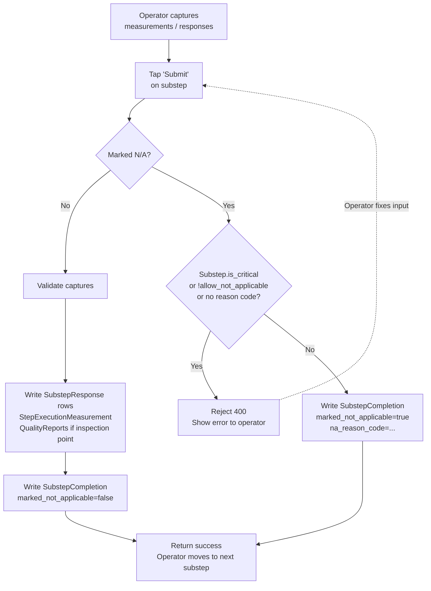

**Key points:**
- Submitting a substep does not advance the part. Advancement happens at
  step completion.
- Inspection-point measurements out of spec trigger flow #3, but the
  submit itself still succeeds.

---

## 2. Operator completes a step (the actual advancement trigger)

This is *the* advancement action. The operator finishes their work at a
station and explicitly indicates the step is done for their part.

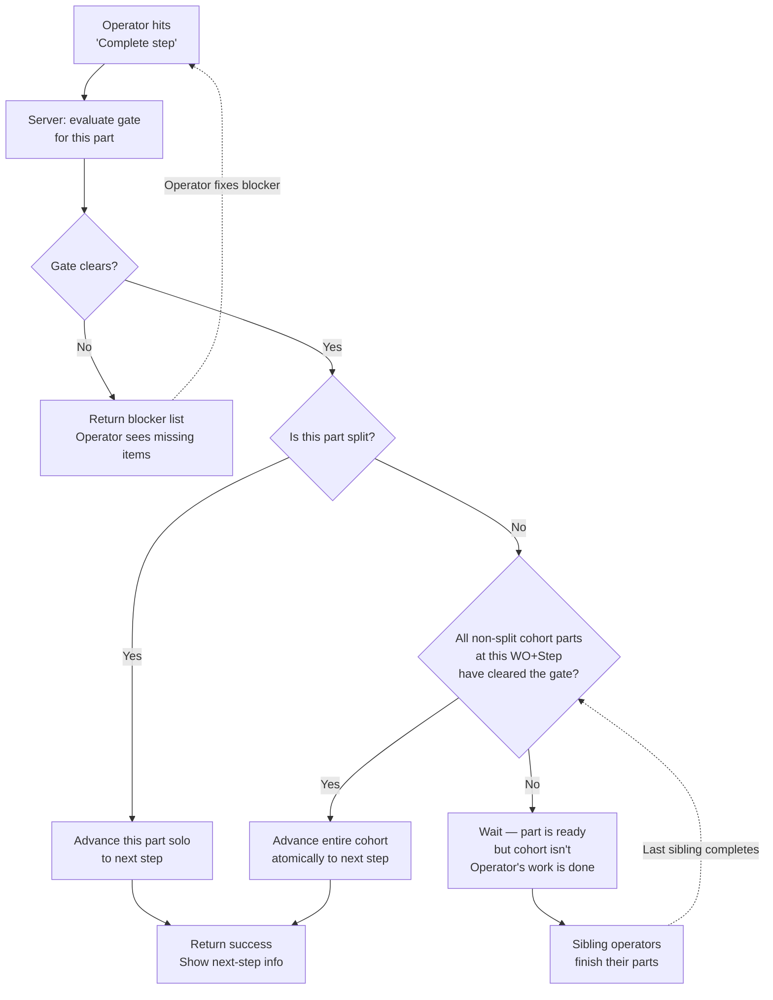

**Key points:**
- Synchronous. One gate evaluation per Complete-step action.
- No background task fires from this. The operator gets the result inline.
- Each operator completes their own part; the lot moves when the last
  sibling does.

---

## 3. Out-of-spec measurement → QA queue (no auto-disposition)

Operator captures a value that's outside tolerance. The system flags it,
but the operator does not disposition.

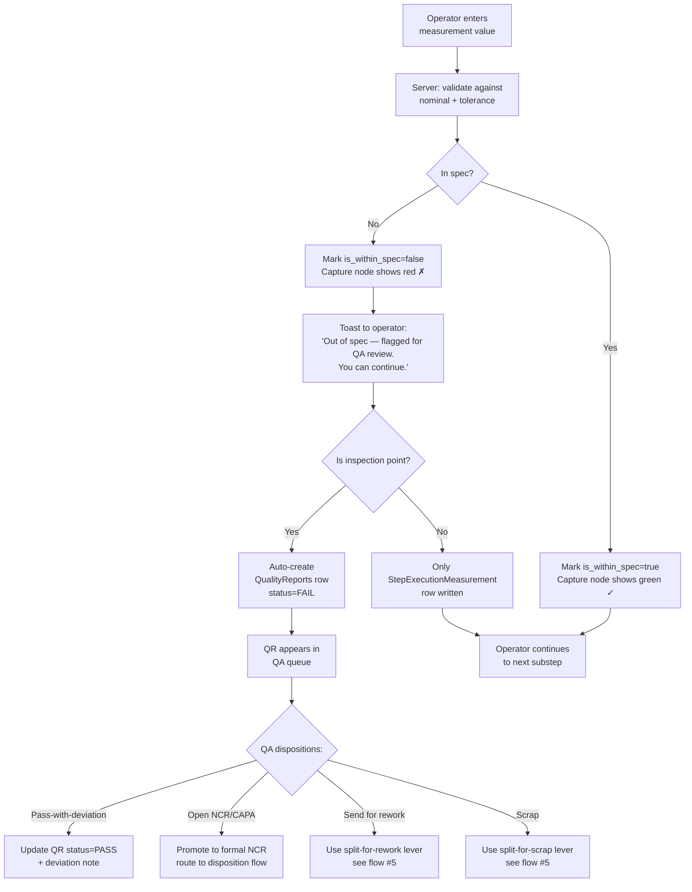

**Key points:**
- Operator never sees a forced-disposition modal. They're not authorized.
- Auto-NCR fires ONLY when the substep is `is_inspection_point=True`.
  Routine process-data captures do not create QualityReports.
- All dispositions are deliberate human actions taken later by QA.

---

## 4. Split for quarantine / scrap

Manual lever to pull a part off the cohort so it advances independently.
Used when a part can't continue with its siblings (quality hold, scrap
decision). Rework has its own flow (#5).

Expedite / customer-pull cases are NOT splits — they bump
`WorkOrder.workorder_priority` so the whole lot moves through queues
faster while staying together. Splitting for expedite creates downstream
packing/shipping pain when the expedited part has to rejoin its siblings
at finished goods.

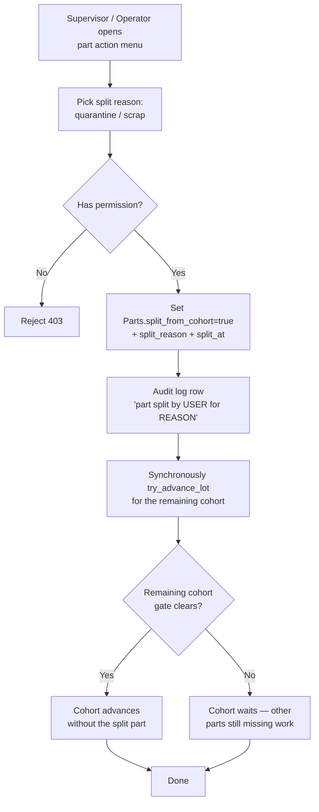

**Key points:**
- Splits are one-way. No re-merge in v1.
- The split itself is the only synchronous side effect; advancement of the
  remaining cohort runs in the same request.

---

## 5. Split for rework (routed via process flow)

Like a regular split, but the part is moved to a `rework_target_step`
defined on the Step's StepEdge graph (edge_type=REWORK), not just held in
place.

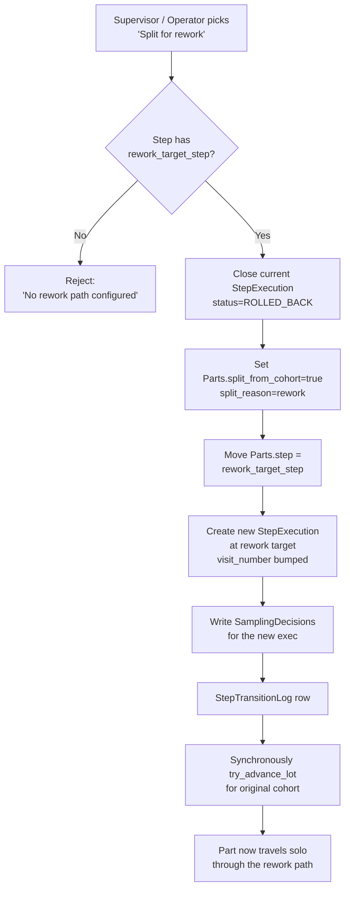

**Key points:**
- The rework path is a part of the process design (StepEdge graph), not
  ad-hoc.
- The reworked part will visit the rework step + come back through the
  canonical flow (often re-entering inspection), generating a new
  StepExecution with `visit_number=N+1`. Prior visit completions don't
  satisfy the new gate.

---

## 6. Force advance (supervisor emergency lever)

For stuck lots that can't resolve through normal flow. Sensor offline,
operator out, missing data that won't be recoverable. Permission-gated.

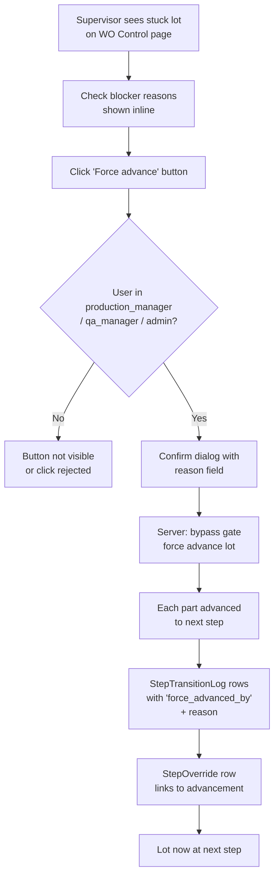

**Key points:**
- Not the default mechanism. It's the safety valve.
- Audit row identifies the human who overrode and why.

---

## 7. Batch lifecycle (per-cohort operations like heat treat)

When a Step has BATCH-scope substeps, an operator manages the batch as a
unit. The seal action is the cohort's "complete step" trigger.

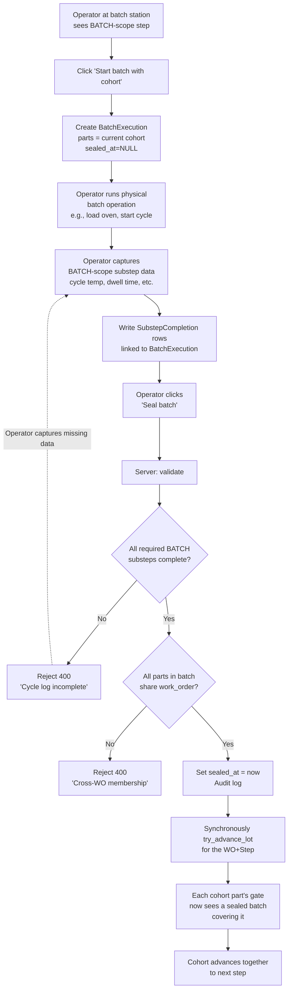

**Key points:**
- Operator deliberately seals; no auto-seal on last capture.
- Sealing is the per-cohort analog of "Complete step" — same advancement
  trigger semantics.
- One BatchExecution per WO. Multi-WO physical runs produce multiple
  BatchExecution rows.

---

## 8. Sampling decision at step entry

When a part enters a step (new StepExecution created), the system writes
one SamplingDecision row per substep. The advancement gate reads these
later.

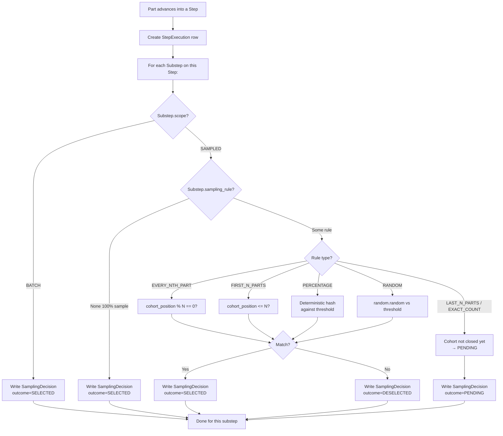

**Key points:**
- Decisions are append-only. Rule changes write new rows with
  `superseded_by` pointing back to the old one.
- PENDING is non-blocking at intermediate steps. The part advances
  tentatively through CNC, assembly, etc.
- PENDING **is blocking at terminal (shipment) steps**. The gate refuses
  to advance any part with live PENDING SamplingDecisions when the step
  is marked `is_terminal=True`, forcing supervisor reconciliation before
  finished goods. Prevents shipping unverified product when rules like
  LAST_N_PARTS / EXACT_COUNT can't decide at part entry.
- Reconciliation at the terminal step is a supervisor UI action — pick
  outcomes manually, or trigger re-evaluation with now-known cohort size.
- DESELECTED substeps are **hidden from the operator's runtime entirely**
  — they don't see the substep, they don't see "Not in sample."

---

## 9. Advancement gate (what `can_advance_from_step` evaluates)

Called synchronously inside any advancement-triggering action (Complete
step, seal batch, force advance, split-driven cohort retry). Returns a list
of blockers; empty list = clear.

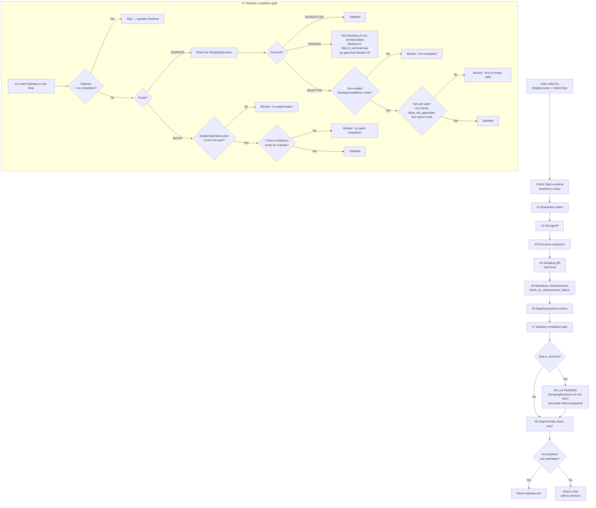

**Key points:**
- Pure read query. No side effects.
- N/A is re-validated at gate time so retroactive `is_critical=True` edits
  invalidate existing N/A rows.
- Voided completions don't satisfy.

---

## 10. QA voids a SubstepCompletion (correction flow)

When QA discovers a problem after the fact — equipment out of cal,
operator did the wrong check, wrong revision pulled — they void the
completion. The gate re-evaluates and blocks downstream.

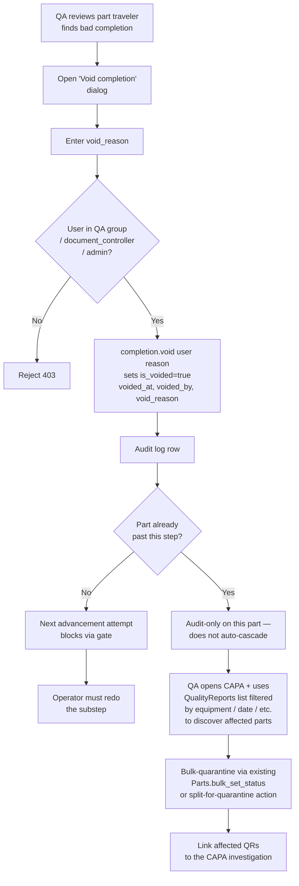

**Key points:**
- Voiding doesn't auto-revert the part. The gate handles it next time
  someone advances.
- For parts already past the step, voiding produces an audit row only;
  containment is a QA-driven CAPA investigation, not an automatic
  cascade.
- Discovery of affected parts happens through the **QualityReports list
  page**, filtered by equipment + date range (or whatever the void
  reason scopes against). Every QR carries the part, the machine, the
  operator, and the timestamp via the M2M-with-role through tables —
  the data is there; QA queries it through the existing list view.
- The CAPA is the system of record for the containment investigation,
  with affected QRs linked as `affected_items`. Bulk-quarantine of
  identified parts uses existing tooling
  (`Parts.bulk_set_status` or split-for-quarantine).

---

## 11. Sampling ruleset supersession (AQL escalation / fallback trigger)

When QA changes the active sampling regime — AQL switches from Normal to
Tightened after consecutive failures, or an engineer publishes a new
ruleset version — existing decisions get superseded.

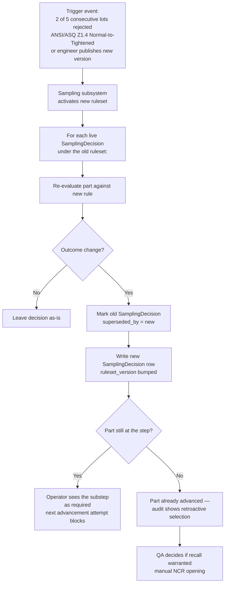

**Key points:**
- Append-only. No decision row is ever updated in place.
- Retroactive selection on a part that already advanced is a QA
  conversation, not an auto-NCR.

---

## 12. What does NOT happen (the negatives)

These are common over-engineerings we explicitly avoid.

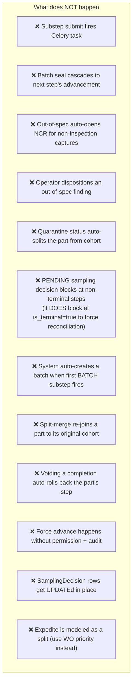

---

## 13. The audit-checklist

Use the boxes below to verify implementation matches the flow charts.

### Currently over-built (Celery + cascades that shouldn't exist)

- [ ] `Tracker/services/mes/advancement_tasks.py` — Celery task. **Delete.**
- [ ] `submit_substep` fires `fire_for_part` (advancement_tasks). **Strip.**
- [ ] `seal_batch` fires `try_advance_lot_task.delay(...)`. **Replace with
  synchronous `try_advance_lot()` call inside the seal request.**
- [ ] `split_part_from_lot` fires `fire_for_part`. **Strip; advancement
  happens synchronously in the split request via direct
  `try_advance_lot()`.**
- [ ] `approve_step_override` fires `fire_for_part`. **Strip.**
- [ ] `try_advance_lot` recurses into next-step advancement. **Remove —
  next step waits for its operator.**

### Currently under-built relative to flows

- [ ] **Flow #2:** Operator runtime's "Complete step" doesn't actually run
  the gate or advance. `handleCompleteStep` only submits captures.
- [ ] **Flow #3:** Out-of-spec capture doesn't show an operator-facing
  toast.
- [ ] **Flow #9:** New blocker #8 (PENDING SamplingDecisions at
  `Step.is_terminal=True`) isn't implemented. Required to force
  pre-shipment reconciliation of LAST_N_PARTS / EXACT_COUNT decisions.
- [ ] **Flow #10:** No QA-side void affordance in the UI.
- [ ] **Flow #11:** No supervisor-side review UI for superseded /
  retroactively-selected decisions.

### Aligned with flows

- [x] **Flow #1:** Substep submit writes captures + completion, returns
  inline result. N/A validation at API boundary.
- [x] **Flow #4:** Split mechanism reason-coded, audit-logged, one-way.
  `PartSplitReason` enum trimmed to QUARANTINE / REWORK / SCRAP — expedite
  goes through WO priority, not a split.
- [x] **Flow #5:** Rework split routes to `rework_target_step`, bumps
  `visit_number`.
- [x] **Flow #6:** Force advance perm-gated on WO Control page.
- [x] **Flow #7:** One BatchExecution per WO invariant; multi-WO oven
  cycles produce N BatchExecution rows.
- [x] **Flow #8:** SamplingDecision write logic correct per rule type.
  DESELECTED substeps show "Not in sample" badge (defensible for IATF
  audit; reversed earlier hide-entirely decision).
- [x] **Flow #9:** Gate blocker order is correct (#1 quarantine → #7
  substep gate → #9 override).
- [x] **Flow #10:** Containment workflow uses existing QualityReports
  list filtering + CAPA, not an auto-cascade.
- [x] **Flow #11:** SamplingDecision append-only with `superseded_by`
  chain. AQL switching trigger documented per ANSI/ASQ Z1.4 (2 of 5
  lots rejected → Tightened).

---

## 14. Deferred items (known, not in this push)

Features and behaviors that the spec acknowledges as real customer needs
but are deferred to future pushes. Pulling these into the current
advancement-engine work would muddy scope.

| Item | Why deferred |
|---|---|
| **OOS operator reason-code prompt** at capture time (operator picks gauge-suspect / setup / material / unknown + continue/re-measure/stop-line). | Waiting for real customer pull before building. Current behavior is silent flag + QA queue. |
| **Pre-capture gauge calibration check** — block measurement submit when the equipment binding has an expired calibration. | Real concern (IATF §7.1.5.2) but a separate calibration-gating push. Existing `EquipmentUsage` machinery captures the data; enforcement at submit is the gap. |
| **Part reclassification / substitute PartType** (reman teardown finds the wrong variant). | Reman-specialized feature. Belongs in a focused reman push alongside R5, not the DWI/advancement push. |
| **SPC analytics reading both `StepExecutionMeasurement` and `MeasurementResult`** so process-data captures drive Cpk / run rules / AQL escalation. | Analytics-layer work; current capture model already records the data correctly. |
| **End-of-shift handoff UI, andon / line-stop, kanban / pull signals**. | Operational features outside DWI scope. Most belong in dispatch / scheduling pushes. |
| **External integrations** — ERP confirmation (CO11N etc.), label printing, andon broadcast, notification fan-out. | Integrations are their own feature track; async observer design belongs there, not in the advancement-engine doc. |
| **Sampling rule evaluators as polymorphic classes** — replace the `rule_type` if-ladder in `sampling_decisions._evaluate_rule` with a strategy-pattern hierarchy (`EveryNthEvaluator`, `FirstNEvaluator`, etc.) and a `RulesetEvaluator` carrying AQL switching state. | Land with the AQL push (which adds `AQL_ATTRIBUTE` rule type + the Normal/Tightened/Reduced switching state machine — the natural forcing function for the refactor). Doing it before AQL is cleanup without a customer-pull reason. |

---

## 15. How the pieces work together

The previous sections describe individual flows. This one shows the
modules and how they interconnect — useful when adding a new trigger,
debugging a stuck lot, or onboarding someone to the codebase.

### Architectural picture

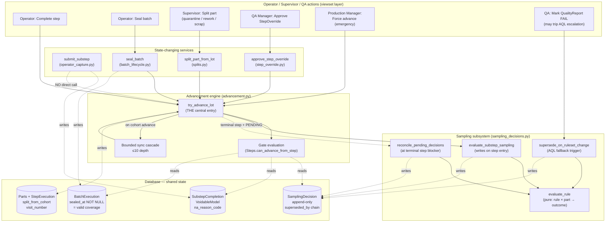

### Reading the diagram

**Layers (top to bottom):**
1. **Triggers** — viewset actions a human (or QA-side automation) initiates
2. **Services** — state-changing units that own a single concern (capture, seal, split, approve)
3. **Engine** — `try_advance_lot` is the single advancement entry; everything else delegates to it
4. **Sampling subsystem** — owns rule evaluation logic + decision writes
5. **Database** — the four tables that carry the engine + sampling shared state

**Arrow types:**
- **Solid arrow** — direct function call
- **Dotted arrow** — database read/write
- **Dotted with label** — conditional call (e.g., only at terminal step with PENDING)

**Key non-relationships (deliberately absent):**
- `submit_substep` → `try_advance_lot`: NO direct call. Substep captures don't trigger advancement. Operator's "Complete step" is the trigger. (Marked with the dotted "NO direct call" line.)
- Sampling subsystem → Engine: never. The engine calls into sampling; sampling never calls into the engine.
- Engine → ruleset lifecycle: never. AQL escalation is triggered by QR FAIL writes, not by advancement.

### The contract between engine and sampling

The engine and sampling subsystem share two thin contracts:

1. **Data contract** — the `SamplingDecision` table. Engine writes via the sampling subsystem; engine reads in the gate. Append-only with `superseded_by` chain for audit.
2. **Function-call contract** — engine calls three sampling functions at specific lifecycle moments:

| Lifecycle moment | Engine action | Sampling function |
|---|---|---|
| Part enters a step (incl. cascade) | Triggers per-substep decision write | `evaluate_substep_sampling(step_execution)` |
| Part reaches `is_terminal=True` with PENDING decisions upstream | Triggers reconciliation before allowing shipment | `reconcile_pending_decisions(work_order, step)` |
| QualityReport FAIL trips AQL switching rule | (engine is NOT involved) | `supersede_on_ruleset_change(old_ruleset, new_ruleset)` triggered from the QR FAIL save path |

The sampling subsystem owns the rule math (`evaluate_rule(rule, part, context) → outcome`) and the ruleset lifecycle (active / inactive / fallback chain). The engine doesn't know about rule types; it just gets back SELECTED / DESELECTED / PENDING via `SamplingDecision.outcome`.

### What "adding a new trigger" looks like

If a new operator/supervisor action could plausibly affect lot advancement, the integration is:

1. Implement the state-changing service (or use an existing one).
2. The service's caller (usually the viewset action) calls `try_advance_lot(work_order_id, step_id, tenant_id)` synchronously after the state change.
3. The advancement result (advanced / blocked / no-op) gets returned to the caller in the same response.

You do NOT:
- Fire a Celery task
- Emit an event
- Subscribe to a signal
- Add a hook inside the service that auto-chains advancement

Caller orchestrates; the engine is the orchestration target.

### What "debugging a stuck lot" looks like

When a lot won't advance, the diagnostic walk is:

1. Call `Steps.can_advance_from_step(step_execution, work_order)` — returns the blocker list.
2. For each blocker, identify the source table:
   - "Substep 'X' not completed" → missing `SubstepCompletion` row, or `is_voided=True` on the existing one
   - "Sampling decision missing" → bug; `SamplingDecision` row absent (the entry hook didn't fire)
   - "Batch substep '...' requires sealed batch" → no `BatchExecution.sealed_at` for the cohort
   - "N/A no longer valid" → substep had `is_critical` flipped to True after the N/A row was written
   - "PENDING reconciliation needed" (terminal blocker #8) → `reconcile_pending_decisions` hasn't run, or PENDING rules can't auto-resolve
3. Fix the data or take the appropriate action (record completion, seal batch, supervisor reconciliation).
4. Re-trigger advancement via the original trigger (Complete step, or supervisor Force-advance for emergency cases).

The diagram makes the "where do I look" question answerable: read the gate's blockers, follow the dotted-read arrows to the table holding the offending row.
